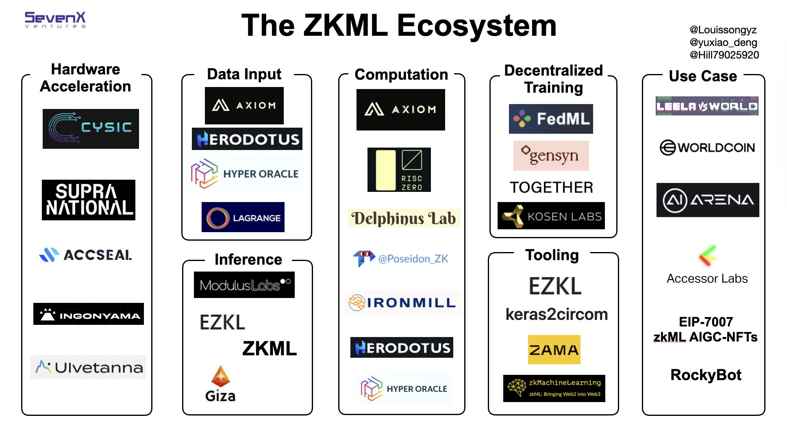

# awesome-zkml

A place where you can find content, codebases, scientific papers, projects and applications related to ZKML. We always appreciate contributions and suggestions. If you have any changes you'd like to suggest, please feel free to open an issue or submit a pull request.

## Learn ZK

Here you can find a list of very popular resources to get started with zero-knowledge cryptography (courtesy of [Ingopedia](https://github.com/ingonyama-zk/ingopedia) made by [Ingonyama](https://twitter.com/Ingo_zk)):

- [Ingopedia](https://github.com/ingonyama-zk/ingopedia)
- [zkProof Standards - Resource](https://zkproof.org/blog/)
- [ZK Mesh - resource](https://zkmesh.substack.com)
- [Curated list of ZKP implementations](https://zkp.science)
- [Awesome - Matter labs - ZK proofs](https://github.com/matter-labs/awesome-zero-knowledge-proofs)
- [Awesome - Mikerah - Privacy on Blockchains](https://github.com/Mikerah/awesome-privacy-on-blockchains)
- [Resource: Awesome_Plonk](https://github.com/Fluidex/awesome-plonk)
- [ZK research 0x](https://0xst.notion.site/ZK-Research-94ba836c3b2a4e2491a871364ee5b13b)
- [ZK canon](https://a16zcrypto.com/zero-knowledge-canon/)
- [Proofs, Args and ZK - Justin Thaler](https://people.cs.georgetown.edu/jthaler/ProofsArgsAndZK.pdf)

## Learn ML

Here you can find a list of very popular resources to get started with machine learning.

- [awesome-machine-learning](https://github.com/josephmisiti/awesome-machine-learning)
  - [books](https://github.com/josephmisiti/awesome-machine-learning/blob/master/books.md)
  - [courses](https://github.com/josephmisiti/awesome-machine-learning/blob/master/courses.md)
  - [content](https://github.com/josephmisiti/awesome-machine-learning/blob/master/courses.md)
  - [events](https://github.com/josephmisiti/awesome-machine-learning/blob/master/events.md)
  - [meetups](https://github.com/josephmisiti/awesome-machine-learning/blob/master/meetups.md)

## Content

### ZKML community calls

We are organizing bi-weekly ZKML community calls. For details on when and where the next call is happening, check the pinned messages on our [Telegram channel](https://t.me/zkmlcommunity). Recorded versions of the calls are available on our [YouTube channel](https://www.youtube.com/channel/UCaAWNrJIVzJIcIAQoUCQ9rw) and notes summarizing what was discussed can be found [here](https://github.com/emilianobonassi/zkml-community-calls).

- [ZKML community call #0](https://www.youtube.com/watch?v=XBCnZ0ssc84)

### Articles and podcasts

- [Zero Knowledge Machine Learning](https://xn--2-umb.com/22/zk-ml/) - [Remco Bloemen](https://twitter.com/recmo)
- [Zero-Knowledge Proofs and Their Applications to Machine Learning (video)](https://www.youtube.com/watch?v=g6FoZ47_EiQ)
- [ZK Machine Learning](https://0xparc.org/blog/zk-mnist)
- [ZK for ML](https://howtocrypto.notion.site/howtocrypto/How-zero-knowledge-proofs-can-certify-Machine-Learning-model-accuracy-6329e927483e4ca8b80fbef2d3bdff51)
- [Zero Knowledge Podcast](https://zeroknowledge.fm/): [Episode 246: Adversarial Machine Learning Research with Florian Tramèr](https://zeroknowledge.fm/246-2/)
- [Zero-Knowledge Machine Learning](https://youtube.com/watch?v=a66iUDRvgWU) by [Jason Morton](http://www.jasonmorton.com/) (video)
- [Modulus Labs](https://www.moduluslabs.xyz/) ([Twitter](https://twitter.com/ModulusLabs))
  - [Chapter 1: How to Put Your AI On-Chain](https://medium.com/coinmonks/chapter-1-how-to-put-your-ai-on-chain-8af2db013c6b)
  - [Chapter 2: Why Put Your AI On-Chain?](https://medium.com/@ModulusLabs/chapter-2-why-put-your-ai-on-chain-33b7625147b7)
  - [Chapter 3: The World’s First On-Chain AI Trading Bot](https://medium.com/@ModulusLabs/chapter-3-the-worlds-first-on-chain-ai-trading-bot-c387afe8316c)
  - [Chapter 4: Blockchains that Self-Improve](https://medium.com/@ModulusLabs/chapter-4-blockchains-that-self-improve-e9716c041f36)
  - [Chapter 5: The Cost of Intelligence](https://medium.com/@ModulusLabs/chapter-5-the-cost-of-intelligence-da26dbf93307)
- [Trustless Verification of Machine Learning](https://medium.com/@danieldkang/trustless-verification-of-machine-learning-6f648fd8ba88) ([Daniel Kang](https://ddkang.github.io/), [Tatsunori Hashimoto](https://thashim.github.io/), [Ion Stoica](http://people.eecs.berkeley.edu/~istoica/), [Yi Sun](https://yisun.io/))
- [ZK Podcast - episode 265: Where ZK and ML intersect with Yi Sun and Daniel Kang](https://zeroknowledge.fm/265-2/)
- [Linear A Research](https://github.com/zk-ml/research)
- [An introduction to zero-knowledge machine learning - Worldcoin](https://worldcoin.org/blog/engineering/intro-to-zkml)
- [Zero Gravity (The Weight is Over) - ZKHack Lisbon](https://hackmd.io/@benjaminwilson/zero-gravity)
- [Zero-Knowledge Decision Tree Prediction (ZK-DTP) - ZKHack Lisbon](https://devfolio.co/projects/zero-knowledge-decision-tree-prediction-zkdtp-6b5f)
- [Open-sourcing zkml: Trustless Machine Learning for All](https://medium.com/@danieldkang/open-sourcing-zkml-trustless-machine-learning-for-all-f5ee1dbf2499) - [Daniel Kang](https://twitter.com/daniel_d_kang)
- [Checks and balances: Machine learning and zero-knowledge proofs](https://a16zcrypto.com/content/article/checks-and-balances-machine-learning-and-zero-knowledge-proofs/) - [Elena Burger @ a16z](https://twitter.com/virtualelena/)
- [ZKML: Bridging AI/ML and Web3 with Zero-Knowledge Proofs](https://hackmd.io/@cathie/zkml) - [Cathie So](https://twitter.com/drCathieSo_eth)
- [Do language models possess knowledge (soundness)?](https://hackmd.io/@pinged/zk-and-llms) - [Tarun Chitra](https://twitter.com/tarunchitra)
- [Balancing the Power of AI/ML: The Role of ZK and Blockchain - SevenX Ventures](https://mirror.xyz/sevenxventures.eth/3USbrj7kcK7lyq_7upA4iyWV5pWMII7KrM40z5zpEXo)
- [The Ultimate Guide to the ZKML ecosystem (Twitter thread)](https://twitter.com/Louissongyz/status/1658087354773671936?s=20) - [SevenX ventures](https://twitter.com/SevenXVentures)
- [Verified Execution of GPT, Bert, CLIP, and more](https://medium.com/@danieldkang/verified-execution-of-gpt-bert-clip-and-more-6acb693fd55f) - [Daniel Kang](https://twitter.com/daniel_d_kang)
- [zkML: Evolving the Intelligence of Smart Contracts Through Zero-Knowledge Cryptography - 1kx](https://mirror.xyz/1kx.eth/q0s9RCH43JCDq8Z2w2Zo6S5SYcFt9ZQaRITzR4G7a_k)
- [Dcbuilder - Zero-Knowledge Machine Learning and its use cases](https://www.youtube.com/watch?v=f4X841gDnwY) (Jul 2023)
- [TensorPlonk: A “GPU” for ZKML, Delivering 1,000x Speedups](https://medium.com/@danieldkang/tensorplonk-a-gpu-for-zkml-delivering-1-000x-speedups-d1ab0ad27e1c) - [Daniel Kang](https://twitter.com/daniel_d_kang)
- [ZK10: ZKML with EZKL: Where we are and the future](https://www.youtube.com/watch?v=YI3ljDis8sc) - [Jason Morton (ZKonduit)](https://twitter.com/jasonmorton)
- [ZK10: ZKML Endgame: Specialized ZK Proving with GKR](https://www.youtube.com/watch?v=tPZDIzrsg-E) - [Ryan Cao (Modulus)](https://twitter.com/nayr_oac)
- [ezkl blog](https://blog.ezkl.xyz/)
- [Modulus blog](https://medium.com/@ModulusLabs)
- [Giza blog](https://www.gizatech.xyz/blog)
- [The promise and challenges of crypto + AI applications - Vitalik Buterin](https://vitalik.eth.limo/general/2024/01/30/cryptoai.html)

## Codebases

- [zk-mnist](https://github.com/0xZKML/zk-mnist) - [@hopanml](https://twitter.com/hopanml) [@sunfishstanford](https://twitter.com/fho888) [@henripal](https://twitter.com/henripal) (2022)
- [zk-ml/demo](https://github.com/zk-ml/demo) - [@liaopeiyuan](https://twitter.com/LiaoPeiyuan) (2021)
- [circomlib-ml](https://github.com/socathie/circomlib-ml) - [@socathie](https://twitter.com/drCathieSo_eth) (2022)
  - [Gitcoin Grant Proposal](https://gitcoin.co/grants/6847/zkmachinelearning-an-end-to-end-platform-to-bridge)
- [proto-neural-zkp](https://github.com/worldcoin/proto-neural-zkp) - [@recmo](https://twitter.com/recmo)
  [@dcbuild3r](https://twitter.com/DCbuild3r) (2022)
  - zkml experiments with plonky2 at Worldcoin
- [RockyBot](https://github.com/Modulus-Labs/RockyBot) - [@ModulusLabs](https://twitter.com/ModulusLabs) (2022)
  - RockyBot is the first ever fully on-chain AI trading bot
- [ezkl](https://github.com/zkonduit/ezkl) by [Jason Morton](https://science.psu.edu/math/people/jrm53) (2022+)
  - ezkl is a library and command-line tool for doing inference for deep learning models and other computational graphs in a zk-snark.
- [keras2circom](https://github.com/socathie/keras2circom) ([@socathie](https://twitter.com/drCathieSo_eth)) (2023)
  - keras2circom is a python tool that transpiles a tf.keras model into a circom circuit.
- [Zator](https://github.com/lyronctk/zator) - Verified inference of a 512-layer neural network using recursive SNARKs.
- [Otti](https://github.com/eniac/otti) (2022)
  - Compiler and zkSNARK for optimization problems including LP, SDP, SGD. Includes ZK proof of the full training of a perceptron on real-world datasets.
- [Linear A - tachikoma](https://github.com/zk-ml/tachikoma) (2022+)
- [Linear A - uchikoma](https://github.com/zk-ml/uchikoma) (2022+)
- [zk-dtp](https://github.com/only4sim/myproject) - Zero Knowledge Decision Tree Predict is designed to address this pressing issue by offering privacy-preserving predictions using decision tree models, built on top of RISC Zero's zkVM.
- [zkp-gravity/0g](https://github.com/zkp-gravity/0g) - ZeroGravity - Zero Gravity is a system for proving an inference run (i.e. a classification) for a pre-trained, public Weightless NN and a private input. (2023)
- [ddkang/zkml](https://github.com/ddkang/zkml) - zkml is a framework for constructing proofs of ML model execution in ZK-SNARKs.
- [ZKaggle](https://github.com/z-kaggle/ZKaggle) and [ZKaggleV2](https://github.com/socathie/ZKaggleV2) - [@socathie](https://twitter.com/drCathieSo_eth) (2023)
  - POC of a decentralized bounty platform for hosting, verifying, and paying out bounties, similar to Kaggle, but with the added benefit of privacy preservation

## Papers

- [Justin Thaler (2013). "Time-Optimal Interactive Proofs for Circuit Evaluation"](https://eprint.iacr.org/2013/351)
- [Pengtao Xie, Misha Bilenko, Tom Finley, Ran Gilad-Bachrach, Kristin Lauter, Michael Naehrig (2014). "Crypto-Nets: Neural Networks over Encrypted Data"](https://arxiv.org/abs/1412.6181)
- [Nathan Dowlin, Ran Gilad-Bachrach, Kim Laine, Kristin Lauter, Michael Naehrig, John Wernsing (2016). "CryptoNets: Applying Neural Networks to Encrypted Data with High Throughput and Accuracy"](https://www.microsoft.com/en-us/research/publication/cryptonets-applying-neural-networks-to-encrypted-data-with-high-throughput-and-accuracy/)
- [Zahra Ghodsi, Tianyu Gu, Siddharth Garg (2017). "SafetyNets: Verifiable Execution of Deep Neural Networks on an Untrusted Cloud"](https://arxiv.org/abs/1706.10268)
- [Payman Mohassel and Yupeng Zhang (2017). "SecureML: A System for Scalable Privacy-Preserving Machine Learning"](https://eprint.iacr.org/2017/396)
- [Jian Liu, Mika Juuti, Yao Lu, and N. Asokan (2017). "Oblivious Neural Network Predictions via MiniONN transformations"](https://eprint.iacr.org/2017/452)
- [Seunghwa Lee, Hankyung Ko, Jihye Kim, and Hyunok Oh (2020). "vCNN: Verifiable Convolutional Neural Network based on zk-SNARKs"](https://eprint.iacr.org/2020/584)
- [Ramy E. Ali, Jinhyun So, A. Salman Avestimehr (2020). "On Polynomial Approximations for Privacy-Preserving and Verifiable ReLU Networks"](https://arxiv.org/abs/2011.05530)
- [Boyuan Feng, Lianke Qin, Zhenfei Zhang, Yufei Ding, and Shumo Chu (2021). "ZEN: An Optimizing Compiler for Verifiable, Zero-Knowledge Neural Network Inferences"](https://eprint.iacr.org/2021/087)
- [Tianyi Liu, Xiang Xie, and Yupeng Zhang (2021). "zkCNN: Zero Knowledge Proofs for Convolutional Neural Network Predictions and Accuracy"](https://eprint.iacr.org/2021/673)
- [Chenkai Weng, Kang Yang, Xiang Xie, Jonathan Katz, and Xiao Wang (2021). "Mystique: Efficient Conversions for Zero-Knowledge Proofs with Applications to Machine Learning"](https://eprint.iacr.org/2021/730) (slides)
- [Jiasi Weng, Jian Weng, Member, IEEE, Gui Tang, Anjia Yang, Ming Li, Jia-Nan Liu (2022). pvCNN: Privacy-Preserving and Verifiable Convolutional Neural Network Testing](https://arxiv.org/abs/2201.09186)
- [Sebastian Angel, Andrew J. Blumberg, Eleftherios Ioannidis, Jess woods (2022). Efficient Representation of Numerical Optimization Problems for SNARKs](https://eprint.iacr.org/2021/1436.pdf)
- [Daniel Kang](https://ddkang.github.io/), [Tatsunori Hashimoto](https://thashim.github.io/), [Ion Stoica](http://people.eecs.berkeley.edu/~istoica/), [Yi Sun](https://yisun.io/) (2022). [Scaling up Trustless DNN Inference with Zero-Knowledge Proofs](https://arxiv.org/abs/2210.08674)
- [Haodi Wang, Thang Hoang (2022). ezDPS: An Efficient and Zero-Knowledge Machine Learning Inference Pipeline](https://arxiv.org/abs/2212.05428)
- [Modulus Labs - The Cost of Intelligence: Proving Machine Learning Inference with Zero-Knowledge](https://drive.google.com/file/d/1tylpowpaqcOhKQtYolPlqvx6R2Gv4IzE/view)

## Projects interested in ZKML

- [Axiom](https://twitter.com/axiom_xyz) - Axiom provides smart contracts trustless access to all on-chain data and arbitrary expressive compute over it. Like GPUs do for CPUs, Axiom augments blockchain consensus with zero-knowledge proofs
- [0xPARC](https://0xparc.org/) - The 0xPARC Foundation promotes application-level innovation on Ethereum and other decentralized platforms
  - [zkMnist](https://0xparc.org/blog/zk-mnist)
- [Worldcoin](https://worldcoin.org/) - A Privacy-Preserving Proof-of-Personhood Protocol
  - [proto-neural-zkp](https://github.com/worldcoin/proto-neural-zkp)
- [Gizatech](https://gizatech.xyz/) - Fully on-chain artificial intelligence on Starknet
- [Modulus Labs](https://www.moduluslabs.xyz/) - Bringing powerful ML models on-chain
- [Risc Zero](https://www.risczero.com/) - The General Purpose Zero-Knowledge VM
- [Supranational](https://www.supranational.net/) - A product and service company developing hardware-accelerated cryptography for verifiable and confidential computing
- [Ingonyama](https://twitter.com/Ingo_zk) (Hardware) - Zero Knowledge ASICs (ZPU)
- [Zama.ai](https://www.zama.ai/) (FHE ML / FHE-ZK ML) - FHE tooling for machine learning, blockchain and more. ZK-FHE is an interesting research area. [FHE.org](https://fhe.org/) is a very interesting community with a lot of potential for collaboration.
- [zkMachineLearning](https://gitcoin.co/grants/6847/zkmachinelearning-an-end-to-end-platform-to-bridge) - ZKML tooling for Circom
- [Aleo](https://www.aleo.org/) - Platform for building fully private and programmable Web applications.
- [PSE team](https://appliedzkp.org/) @ Ethereum Foundation - Some ZKML research initiatives [here](https://hackmd.io/@cathie/zkml-research)
- [Ion Protocol](https://ionprotocol.io/) - Lending protocol for staked & restaked assets. They partnered with Modulus to build a risk engine that analyzes validator credit risk. Read more [here](https://twitter.com/ionprotocol/status/1727193815218581726)

## Use cases

Decision tree for a use case that would use ZKML -> Intersection of {needs privacy, computational integrity} and {heuristic optimization problem solved by ml}.

- Computational integrity
  - [Modulus Labs](https://www.moduluslabs.xyz/)
    - On-chain verifiable ML trading bot - [RockyBot](https://github.com/Modulus-Labs/RockyBot)
    - Blockchains that self-improve vision (examples):
      - Enhancing the [Lyra finance](https://www.lyra.finance/) options protocol AMM with intelligent features
      - Creating a transparent AI-based reputation system for [Astraly](https://www.astraly.xyz/)
      - Working on the technical breakthroughs needed for contract-level compliance tools using ML for [Aztec Protocol](https://aztec.network/) (a zk-rollup with privacy features)
  - ML as a Service (MLaaS) transparency ([link](https://twitter.com/daniel_d_kang/status/1582519854405255168?s=20&t=16FXZixQvD5G_B9IFVzmaA))
  - [Worldcoin](https://worldcoin.org/the-worldcoin-protocol)
    - Verifying that a user has created a valid and unique [WorldID](https://worldcoin.org/the-worldcoin-protocol) locally by running the IrisCode model on self-hosted biometric data and is calling [\_addMember(uint256 groupId, uint256 identityCommitment)](https://github.com/semaphore-protocol/semaphore/blob/4e6be04729ed2d7e29461a3915877a66a2c9c4d2/contracts/base/SemaphoreGroups.sol#L43) function on the WorldID Semaphore identity group with a valid identityCommitment. -> Makes protocol more permissionless
    - Making the Orb trustless, provide proof that fraud filters are applied
    - Enable IrisCode upgradeability
  - ZK anomaly/fraud detection
    - Creates the ability for creating a ZK proof of [exploitability](https://blog.trailofbits.com/2020/05/21/reinventing-vulnerability-disclosure-using-zero-knowledge-proos/)/fraud. Anomaly detection models could be trained on smart contract data and agreed upon by DAOs as interesting metrics to be able to automate security procedures such as preventively pausing contracts in a more proactive way. There are startups already looking at using ML models for security purposes in a smart contract context, so ZK anomaly detection proofs feel like the natural next step.
  - Generic SNARK for ML inference: ability to easily prove and verify that an output is the product of a given model and input pair.
- Privacy
  - Decentralized Kaggle: proof that model has greater than x% accuracy on some test data without revealing weights
  - Privacy-preserving inference: medical diagnostics on private patient data get fed into the model and the sensitive inference (i.e. cancer test result) gets sent to the patient. ([vCNN paper, page 2/16](https://eprint.iacr.org/2020/584.pdf))
